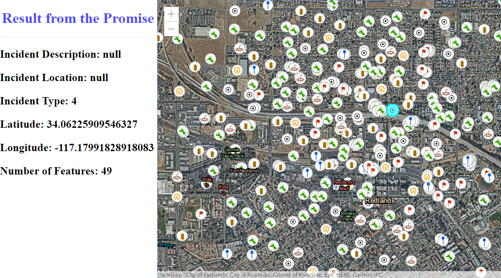

# chainingPromises
This project is meant to demonstrate the use of promise chaining. This application uses the ArcGIS JavaScript API 4.x to populate the side-panel with a feature's attribute information. The application uses the .hitTest() method of the MapView to return the attribute information. The application then uses the feature returned to query the total number of features with the same 'IncidentType' value as the selected feature. Finally, the feature is highlight as well.

## Getting Started

This html file is ready for deployment. The FeatureLayer used is the following point feature service hosted on ArcGIS Online:
https://services.arcgis.com/V6ZHFr6zdgNZuVG0/ArcGIS/rest/services/IncidentsReport/FeatureServer/0

## How to use the sample

Run the application, and wait for the FeatureLayer to load.
Once it is done loading, then click on one of the feature symbols in the MapView. The side-panel will populate with some of the feature's attributes. Additionally the total number of features in the layer with the same 'IncidentType' value of the selected feature will display in the side panel.

## Deployment
One can deploy the application over a local web server (example: ISS), but it can also be ran directly from your computer by double clicking the html file when downloaded.

## Built With

* [ArcGIS JavaScript API](https://developers.arcgis.com/javascript/) - Using the 4.10 JavaScript API

## Relevant API
* Map
* MapView
* FeatureLayer
